# Inmobiliaria Los Andes del Ecuador

## Proyecto de Fin de Curso
## David Lema
## ISTER

Plataforma web inmobiliaria desarrollada para centralizar la publicación
de propiedades, atención de prospectos, gestión de citas, seguimiento
comercial, trámites, administración de personal y procesos contables.

El sistema está compuesto por una **web pública** para clientes y
visitantes y una **intranet administrativa** para el personal de la
inmobiliaria.

------------------------------------------------------------------------

## 1. Objetivo general

Desarrollar una plataforma web que permita gestionar de manera integrada
los procesos comerciales y administrativos de una inmobiliaria, desde la
captación inicial de un prospecto hasta la gestión del cliente, el
trámite y el registro contable de una operación exitosa.

### Objetivos específicos

-   Publicar y consultar propiedades disponibles para venta o arriendo.
-   Facilitar solicitudes de contacto, asesoría, trámites y citas.
-   Gestionar prospectos mediante un flujo CRM.
-   Mantener trazabilidad de las interacciones con los clientes.
-   Administrar propiedades, fotografías, asesores y postulaciones.
-   Gestionar clientes y trámites inmobiliarios.
-   Registrar operaciones, gastos, comisiones y facturación.
-   Aplicar roles para controlar el acceso a la intranet.
-   Mantener una arquitectura preparada para continuar ampliando el
    sistema.

------------------------------------------------------------------------

## 2. Tecnologías utilizadas

  Tecnología      Uso
  --------------- -------------------------------------------------
  PHP 8.x         Lenguaje principal del backend
  Laravel 12      Framework MVC
  Blade           Motor de plantillas
  Tailwind CSS    Diseño de interfaces
  JavaScript      Interacciones de interfaz
  Alpine.js       Componentes interactivos en determinadas vistas
  MySQL           Base de datos relacional
  Eloquent ORM    Acceso y relaciones de datos
  Composer        Dependencias PHP
  Node.js / NPM   Dependencias y compilación frontend
  Apache          Servidor web
  Docker          Contenedor de producción
  Git             Control de versiones
  GitHub          Repositorio remoto
  Render          Despliegue de la aplicación
  Aiven MySQL     Base de datos de producción

------------------------------------------------------------------------

# 3. Arquitectura general

La aplicación sigue el patrón **MVC (Modelo - Vista - Controlador)**
utilizado por Laravel.

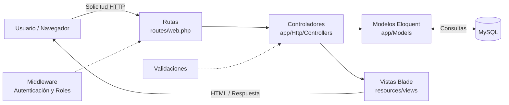

### Flujo de una solicitud

1.  El usuario realiza una solicitud desde el navegador.
2.  Laravel recibe la solicitud mediante una ruta.
3.  La ruta dirige la petición al controlador correspondiente.
4.  El controlador ejecuta la lógica de negocio.
5.  Los modelos Eloquent consultan o modifican la base de datos.
6.  El controlador envía los datos a una vista Blade.
7.  La vista genera la respuesta que recibe el usuario.

------------------------------------------------------------------------

# 4. Arquitectura funcional

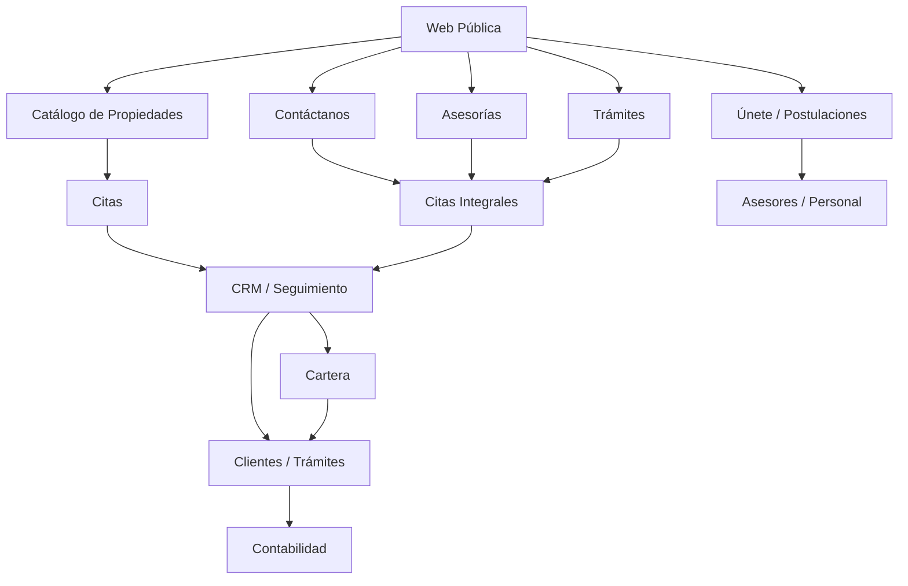

------------------------------------------------------------------------

# 5. Flujo CRM y estados

Uno de los componentes principales del sistema es el flujo de
seguimiento comercial.

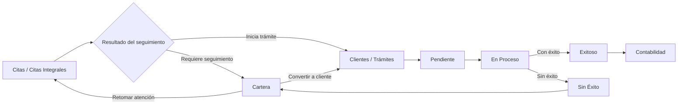

### Regla de trazabilidad

El sistema busca que un registro operativo se encuentre en **una sola
etapa principal a la vez**, evitando duplicar innecesariamente clientes
entre módulos.

El historial del prospecto permite conservar información sobre su origen
y movimientos anteriores.

------------------------------------------------------------------------

# 6. Flujo Clientes / Trámites

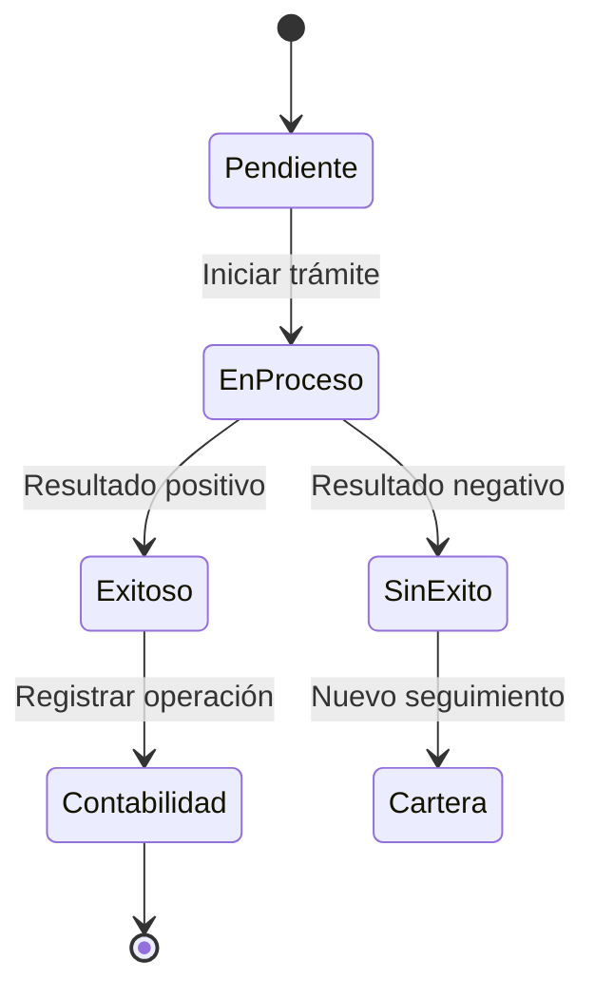

Este flujo permite separar la etapa comercial de la etapa formal del
trámite y de la etapa financiera.

------------------------------------------------------------------------

# 7. Flujo de una operación inmobiliaria

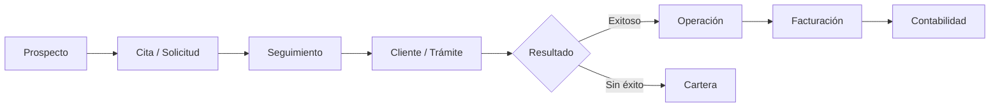

------------------------------------------------------------------------

# 8. Módulos principales

## 8.1 Web pública

La plataforma pública permite:

-   Visualizar el catálogo inmobiliario.
-   Filtrar propiedades.
-   Consultar propiedades en venta y arriendo.
-   Revisar características, precio y ubicación.
-   Consultar fotografías.
-   Solicitar citas.
-   Enviar solicitudes de contacto.
-   Solicitar asesorías.
-   Solicitar trámites.
-   Consultar información institucional.
-   Enviar postulaciones mediante **Únete / Trabaja con nosotros**.
-   Adjuntar hoja de vida cuando corresponda.

### Captura sugerida

> **Agregar aquí una captura de la página principal o del catálogo
> público.**

------------------------------------------------------------------------

## 8.2 Gestión de propiedades

El módulo administrativo permite:

-   Registrar propiedades.
-   Modificar información.
-   Consultar propiedades existentes.
-   Gestionar datos del propietario.
-   Registrar ubicación.
-   Definir venta o arriendo.
-   Registrar precio.
-   Gestionar características del inmueble.
-   Gestionar fotografías.
-   Definir imagen principal.
-   Reordenar fotografías.
-   Eliminar fotografías cuando corresponda.

### Flujo de propiedades

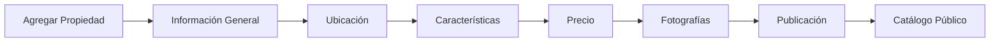

### Captura sugerida

> **Agregar aquí una captura del módulo Propiedades y otra del
> formulario Agregar Propiedad.**

------------------------------------------------------------------------

## 8.3 Gestión de Citas

El módulo permite realizar seguimiento a solicitudes relacionadas con
propiedades.

Entre sus funciones se encuentran:

-   Crear citas.
-   Modificar citas.
-   Gestionar estados.
-   Asignar fechas.
-   Confirmar citas.
-   Registrar atención.
-   Enviar prospectos a Cartera.
-   Continuar hacia Clientes / Trámites.

------------------------------------------------------------------------

## 8.4 Citas Integrales

Centraliza solicitudes provenientes de diferentes canales de la
plataforma, entre ellos:

-   Contáctanos.
-   Asesorías.
-   Trámites.
-   Otros canales de atención configurados.

Los registros pueden avanzar hacia Cartera o hacia Clientes / Trámites
según el resultado del seguimiento.

------------------------------------------------------------------------

## 8.5 Cartera

Cartera contiene prospectos que requieren seguimiento adicional.

Permite conservar:

-   Origen del prospecto.
-   Registro relacionado.
-   Estado anterior.
-   Propiedad relacionada.
-   Asesor.
-   Canal de contacto.
-   Plataforma social.
-   Enlace del perfil social cuando corresponda.
-   Motivo de ingreso.
-   Estado de cartera.
-   Notas.
-   Fecha de ingreso.
-   Historial del prospecto.

------------------------------------------------------------------------

## 8.6 Prospectos e historial

El sistema incorpora entidades para conservar la trazabilidad de los
prospectos.

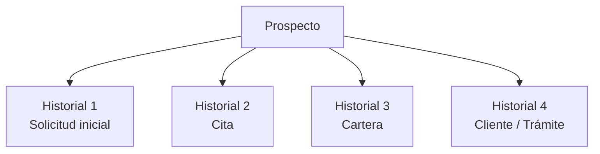

Esto permite conocer el recorrido del cliente dentro de la plataforma.

------------------------------------------------------------------------

## 8.7 Clientes / Trámites

Los prospectos convertidos pasan a la etapa de Clientes / Trámites.

Estados principales:

-   Pendiente.
-   En Proceso.
-   Exitoso.
-   Sin Éxito.

Un trámite exitoso puede continuar hacia **Contabilidad**.

Un trámite sin éxito puede regresar a **Cartera**.

------------------------------------------------------------------------

## 8.8 Asesores y personal

El módulo permite administrar el personal de la inmobiliaria.

Funciones principales:

-   Consultar personal registrado.
-   Registrar nuevos asesores.
-   Modificar información.
-   Consultar información individual.
-   Activar o desactivar usuarios.
-   Asignar roles.
-   Registrar metas económicas.
-   Consultar postulantes recibidos desde la web pública.

### Roles contemplados

-   Administrador/Gerente.
-   Asesor.
-   Trámites.
-   Contador.
-   Publicista.

### Captura sugerida

> **Agregar aquí una captura de Gestión Integral de Asesores.**

------------------------------------------------------------------------

## 8.9 Postulaciones

El formulario público **Únete / Trabaja con nosotros** permite registrar
candidatos.

Entre los datos manejados se encuentran:

-   Nombres.
-   Apellidos.
-   Celular.
-   Correo.
-   Profesión.
-   Ciudad.
-   Experiencia.
-   Hoja de vida.

Las postulaciones pueden ser consultadas desde la intranet.

------------------------------------------------------------------------

# 9. Contabilidad

El módulo de Contabilidad administra la etapa financiera de las
operaciones inmobiliarias.

Entre sus componentes se encuentran:

-   Operaciones.
-   Transacciones.
-   Ingresos.
-   Gastos.
-   Categorías.
-   Subcategorías.
-   Grupos.
-   Presupuestos.
-   Participantes.
-   Comisiones.
-   Configuración de comisiones.
-   Costos de vehículo.
-   Facturación.
-   Historial de facturas.
-   Libro de movimientos.
-   Reportes.
-   Estado de pérdidas y ganancias.

### Flujo contable

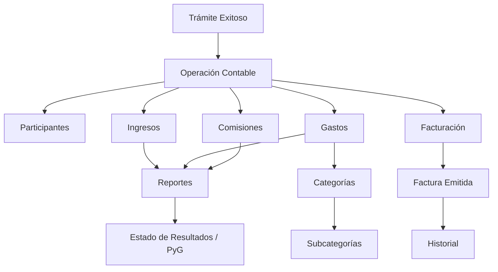

### Captura sugerida

> **Agregar aquí capturas del panel de Contabilidad, Facturación y
> Estado de Resultados.**

------------------------------------------------------------------------

# 10. Modelo de datos simplificado

El proyecto utiliza una base de datos relacional MySQL. El siguiente
diagrama resume las relaciones funcionales principales.

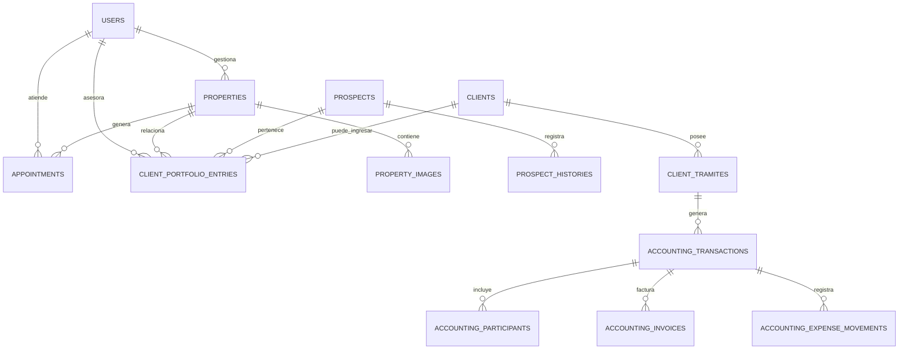

> Para documentación técnica detallada se recomienda complementar este
> diagrama con el modelo entidad-relación completo generado desde la
> base de datos.

------------------------------------------------------------------------

# 11. Estructura principal del proyecto

``` text
inmobiliaria-andes/
│
├── app/
│   ├── Http/
│   │   └── Controllers/
│   └── Models/
│
├── database/
│   ├── migrations/
│   └── seeders/
│
├── public/
│
├── resources/
│   └── views/
│       ├── intranet/
│       └── layouts/
│
├── routes/
│   └── web.php
│
├── storage/
│   └── app/
│       └── public/
│
├── Dockerfile
├── composer.json
├── package.json
└── artisan
```

------------------------------------------------------------------------

# 12. Controladores principales

  Controlador                   Responsabilidad
  ----------------------------- ---------------------------------------
  `AuthController`              Autenticación y acceso
  `PublicController`            Funciones de la web pública
  `PublicPropertyController`    Catálogo y detalle público
  `PropertyController`          Gestión administrativa de propiedades
  `PropertyImageController`     Fotografías de propiedades
  `AppointmentController`       Citas, cartera y parte del flujo CRM
  `ClientController`            Gestión de clientes
  `ClientTramiteController`     Clientes y trámites
  `TramiteController`           Gestión de trámites
  `AccountingController`        Contabilidad
  `UserController`              Personal y asesores
  `JobApplicationController`    Postulaciones
  `AdvisoryRequestController`   Solicitudes de asesoría
  `SocialLinkController`        Enlaces sociales

------------------------------------------------------------------------

# 13. Seguridad

El proyecto contempla diferentes mecanismos de seguridad proporcionados
por Laravel y por la lógica de la aplicación:

-   Autenticación.
-   Control de acceso por roles.
-   Protección CSRF.
-   Validación de formularios.
-   Hash de contraseñas.
-   Validación de archivos.
-   Manejo de sesiones.
-   Separación de rutas públicas e intranet.
-   Variables sensibles mediante `.env`.

> **Importante:** nunca se deben subir al repositorio contraseñas,
> claves API, certificados privados ni el archivo `.env`.

------------------------------------------------------------------------

# 14. Instalación en entorno local

## Requisitos

-   PHP compatible con Laravel 12.
-   Composer.
-   MySQL / MariaDB.
-   Node.js y NPM.
-   Git.
-   Servidor Apache o entorno XAMPP.

## Instalación

``` bash
git clone <URL_DEL_REPOSITORIO>
cd inmobiliaria-andes
composer install
npm install
```

Crear el archivo de configuración:

``` bash
cp .env.example .env
php artisan key:generate
```

Configurar la conexión MySQL en `.env`.

Ejecutar:

``` bash
php artisan migrate
php artisan storage:link
npm run build
php artisan optimize:clear
```

Para desarrollo:

``` bash
php artisan serve
```

------------------------------------------------------------------------

# 15. Comandos de verificación

### Limpiar caché

``` bash
php artisan optimize:clear
```

### Verificar rutas

``` bash
php artisan route:list
```

### Estado de migraciones

``` bash
php artisan migrate:status
```

### Ejecutar migraciones

``` bash
php artisan migrate
```

### Migraciones en producción

``` bash
php artisan migrate --force
```

------------------------------------------------------------------------

# 16. Control de versiones

El proyecto utiliza Git y GitHub.

Flujo habitual:

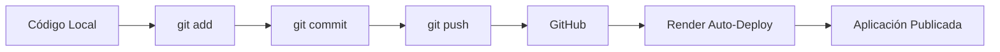

Comandos:

``` bash
git status
git add .
git commit -m "Descripción del cambio"
git push origin main
```

------------------------------------------------------------------------

# 17. Despliegue

La aplicación se encuentra preparada para despliegue mediante Docker.

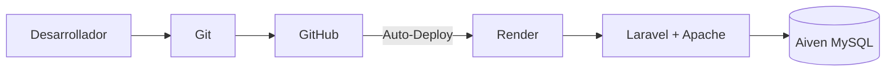

## Docker

El contenedor de producción se encarga de:

1.  Instalar las dependencias del sistema.
2.  Instalar extensiones PHP.
3.  Instalar Composer.
4.  Instalar dependencias Laravel.
5.  Compilar recursos frontend.
6.  Preparar permisos de `storage`.
7.  Configurar Apache para `/public`.
8.  Crear el enlace de almacenamiento.
9.  Ejecutar migraciones de producción.
10. Iniciar Apache.

------------------------------------------------------------------------

# 18. Almacenamiento de archivos

En Laravel los archivos públicos se manejan mediante:

``` text
storage/app/public/
```

y se exponen mediante:

``` text
public/storage
```

El enlace se crea con:

``` bash
php artisan storage:link
```

Para una implementación comercial definitiva se recomienda utilizar
almacenamiento persistente externo para fotografías y documentos,
especialmente cuando la infraestructura utiliza contenedores con
almacenamiento efímero.

------------------------------------------------------------------------

# 19. Base de datos de producción

La aplicación utiliza MySQL.

En producción, la conexión se configura mediante variables de entorno:

``` text
DB_CONNECTION=mysql
DB_HOST=
DB_PORT=
DB_DATABASE=
DB_USERNAME=
DB_PASSWORD=
```

Las credenciales reales **no deben documentarse ni almacenarse en
GitHub**.

------------------------------------------------------------------------

# 20. Pruebas recomendadas

Después de cada despliegue se recomienda verificar:

-   Página principal.
-   Catálogo público.
-   Detalle de propiedades.
-   Fotografías.
-   Login.
-   Panel administrativo.
-   Gestión de propiedades.
-   Citas.
-   Citas Integrales.
-   Cartera.
-   Clientes / Trámites.
-   Asesores.
-   Postulaciones.
-   Contabilidad.
-   Facturación.
-   Cierre de sesión.

------------------------------------------------------------------------

# 21. Capturas recomendadas para este documento

Para complementar este archivo en la documentación académica pueden
añadirse imágenes en una carpeta del repositorio:

``` text
docs/images/
```

Ejemplo:

``` text
docs/
└── images/
    ├── arquitectura.png
    ├── modelo-er.png
    ├── flujo-crm.png
    ├── catalogo.png
    ├── propiedades.png
    ├── cartera.png
    ├── clientes-tramites.png
    ├── contabilidad.png
    └── render-live.png
```

Para insertar una imagen en Markdown:

``` markdown

```

Ejemplo para los diagramas preparados:

``` markdown


*Figura 1. Modelo entidad-relación de la base de datos.*


*Figura 2. Flujo CRM: Citas / Citas Integrales → Cartera → Clientes / Trámites → Contabilidad.*
```

> Los diagramas Mermaid incluidos en este documento pueden visualizarse
> directamente en plataformas compatibles como GitHub.

------------------------------------------------------------------------

# 22. Mejoras futuras

-   Almacenamiento persistente para imágenes y documentos.
-   Dominio propio.
-   Infraestructura de producción de pago.
-   Mayor granularidad de permisos.
-   Respaldos automatizados.
-   Pruebas automatizadas.
-   Notificaciones.
-   Métricas y paneles estadísticos.
-   Ampliación de reportes.
-   Optimización de rendimiento.
-   Integraciones externas para marketing y comunicación.

------------------------------------------------------------------------

# 23. Estado del proyecto

El proyecto dispone de:

-   Web pública.
-   Catálogo inmobiliario.
-   Intranet administrativa.
-   Gestión de propiedades.
-   Gestión de fotografías.
-   Citas.
-   Citas Integrales.
-   CRM.
-   Prospectos.
-   Historial.
-   Cartera.
-   Clientes / Trámites.
-   Gestión de asesores.
-   Postulaciones.
-   Contabilidad.
-   Facturación.
-   Reportes.
-   Control de roles.
-   Base de datos MySQL.
-   Control de versiones con Git.
-   Despliegue mediante Docker.

El sistema continúa siendo ampliable y puede evolucionar desde su
finalidad académica hacia una plataforma de operación inmobiliaria de
mayor alcance.

------------------------------------------------------------------------

# 24. Documentación complementaria

El proyecto cuenta con documentación separada para:

-   **Manual de Usuario**
-   **Manual de Administrador**
-   **Manual del Desarrollador**

Estos documentos explican el uso funcional y técnico de la plataforma
con mayor detalle.

------------------------------------------------------------------------

## Proyecto académico

**Inmobiliaria Los Andes del Ecuador**\
Riobamba - Ecuador\
2026
